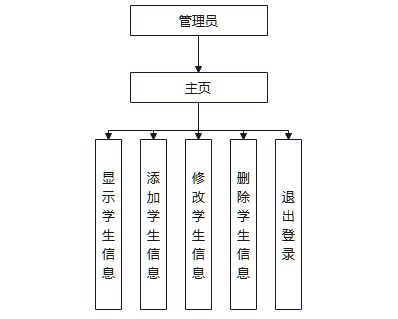
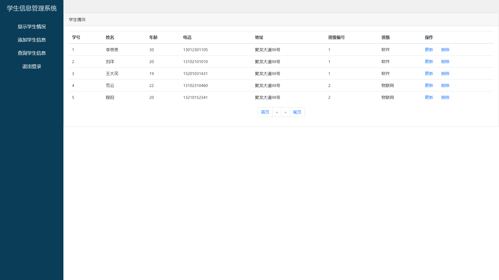
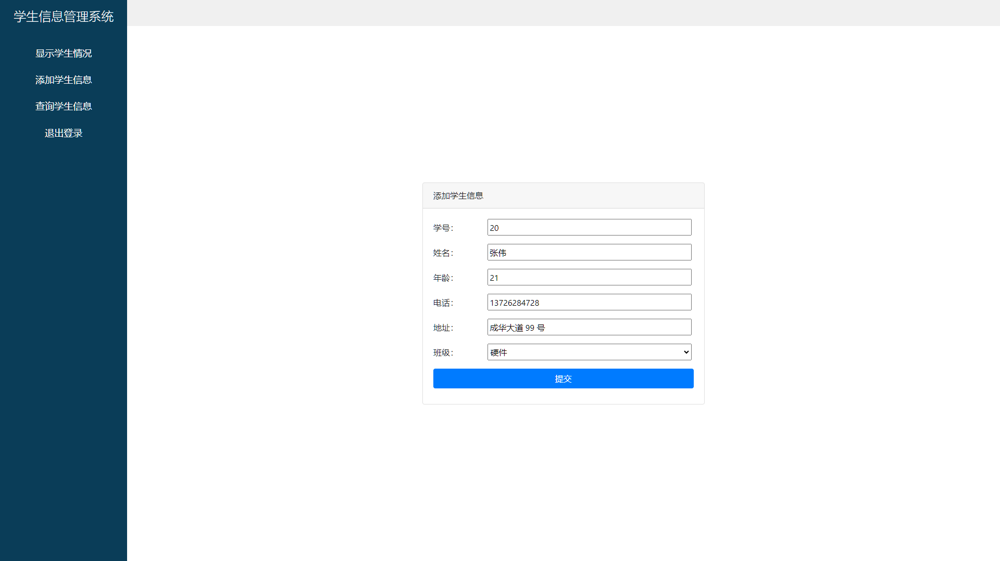
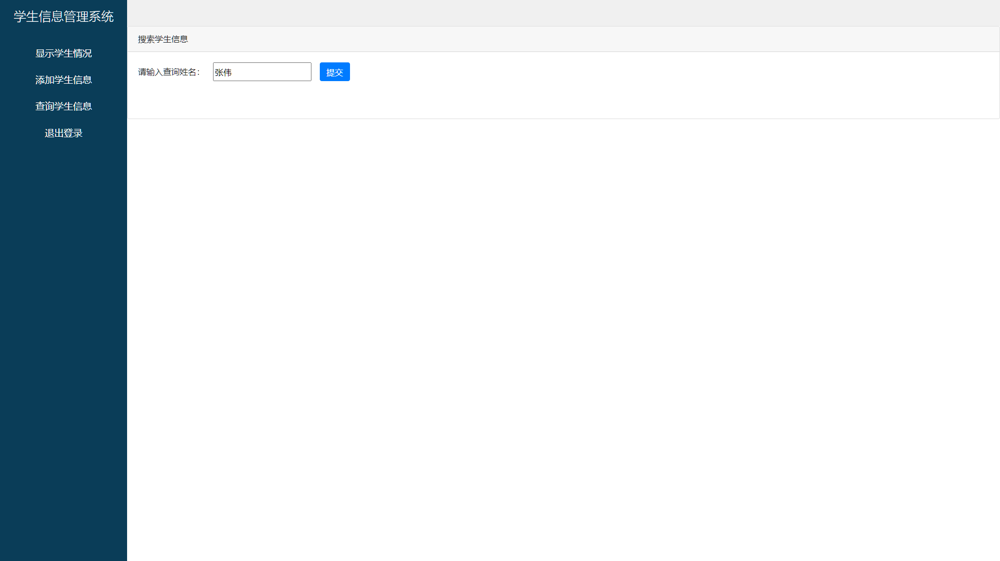
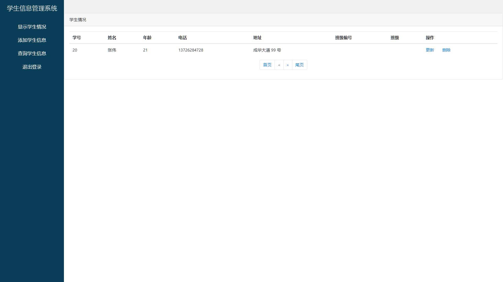
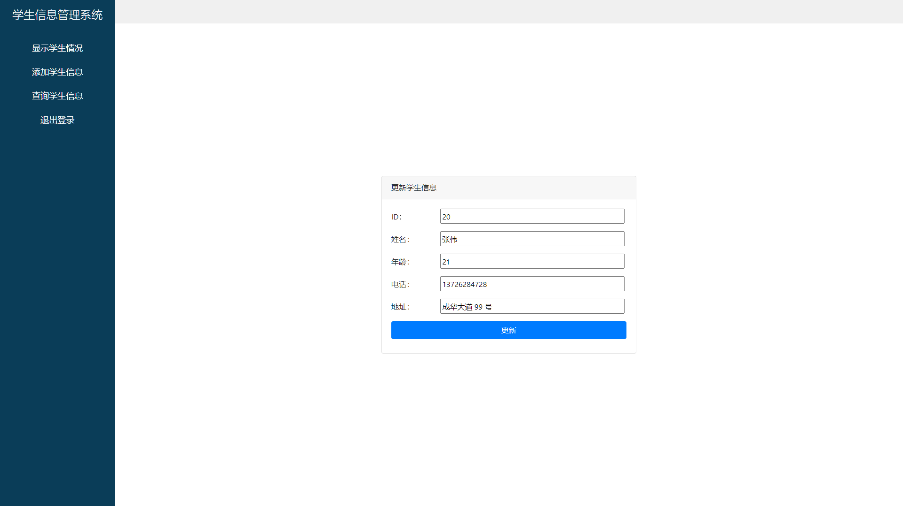

# 学生信息管理系统

项目名称：学生信息管理系统

技术栈：JSP + Servlet + JSTL 标签 + JavaBean + bootstrap4 + MySQL

开发工具：IDEA 2023 Navicat

开发环境：tomcat9+ mysql5.7

账号密码：Admin / 123456

简介：本项目遵循 GPL-3.0 license 协议

## 项目结构

### DAO - 业务层

| 名称      | 描述            |
| --------- | --------------- |
| DAO       | 数据库访问接口  |
| DaoFromDB | 实现 Dao 接口类 |

### Servlet - 控制器

| 名称          | 描述             |
| ------------- | ---------------- |
| DeleteServlet | 用于删除学生信息 |
| GradeServlet  | 用于查询班级信息 |
| ImplServlet   | 用于显示学生信息 |
| InserServlet  | 用于插入学生信息 |
| LoginServlet  | 用于管理员登录   |
| SerachServlet | 用于查询学生信息 |
| UpdateServlet | 用于更新学生信息 |

### Filter - 过滤器

| 名称   | 描述                 |
| ------ | -------------------- |
| Filter | 用于过滤未登录的用户 |

### Entity - 实体类

| 名称    | 描述     |
| ------- | -------- |
| Student | 学生实体 |
| Grade   | 班级实体 |

## 数据库结构

### grade - 班级信息表

| 列名  | 类型 | 长度 | 描述     |
| ----- | ---- | ---- | -------- |
| id    | int  | 11   | id       |
| gid   | int  | 11   | 班级 ID  |
| gname | char | 255  | 班级名称 |

### student - 学生信息表

| 列名    | 类型    | 长度 | 描述       |
| ------- | ------- | ---- | ---------- |
| id      | int     | 11   | id         |
| name    | varchar | 20   | 学生名     |
| age     | int     | 11   | 学生年龄   |
| tel     | char    | 255  | 学生手机号 |
| address | char    | 60   | 学生地址   |
| gid     | int     | 11   | 学生班级   |

### user - 用户信息表

| 列名     | 类型 | 长度 | 描述   |
| -------- | ---- | ---- | ------ |
| id       | int  | 11   | id     |
| name     | char | 255  | 用户名 |
| password | char | 255  | 密码   |

## 项目预览

### 登录页面

### 学生信息显示

### 添加学生信息

### 查询学生信息

### 更新学生信息

